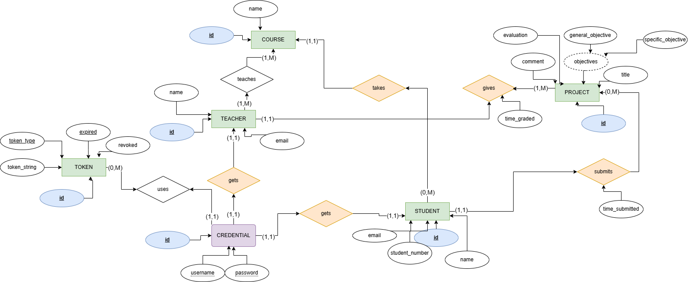

# ROCKS_TEMAS
## Requisitos/Problemas a resolver
> ## Foco na apresentação dos temas de forma organizada
> * Submeter temas
> * Avaliar os temas
> * Cadastrar estudantes
> * Cadastrar docentes
> * Filtras os temas de acordo com os cursos, nome;
> * Permitir que o usuário pesquise por nome, curso, título, número de estudante, estado de avaliação
> * A data e hora de submissão e a data e hora da avaliação devem ser registrados

## Entidades do sistema

* **1. DOCENTE** - representa a entidade responsável por avaliar os alunos e por comentar.
    * **Estados**
        - **Activo**
        
* **2. ESTUDANTE** - representa os usuários que irão submeter os seus temas e serão avaliados.
    * **Estados**
        - **Activo** - logo que o estudante é criado, ele passa para este estado

* **3. PROJECTO** - representa os dados que serão submetidos pelos estudantes e avaliados pelos docentes.
    - **Estados**
        * **Submetido** - quando o projecto é submetido pelo estudante e requer avaliação
        * **Aprovado** - o projecto foi avaliado pelo docente e foi aprovado.
        * **Reprovado** - projecto foi avaliado e reprovado, por alguma razão.
        * **Por melhorar** - o projecto precisa de alguma melhoria para ser posteriormente aprovado ou reprovado. 

* **4. CURSO** - representa os cursos existentes na instituição

* **5. PARECER_DEPARTAMENTO** - represente o parecer do departamento quanto ao tema. Nele ficam registrados os comentários dos docentes e a avaliação por eles feita a cada tema.

## Regras de negócio
* Se um projecto já foi aprovado ou reprovado, não se pode voltar a submeter um idêntico;
* Um docente não pode avaliar estudantes de um curso ao qual ele não dá aulas;
* Só os docentes é que podem comentar sobre os temas;
* Um estudante só pode pertencer a um departamento;
* Docentes não podem submeter projectos;
* Estudante pode apagar projecto, caso este ainda não tenha sido avaliado

##  Descrição
Tanto o docente como o estudante, deverão se cadastrar na plataforma, de modo a cada um deles realizar as operações desejadas. Depois de cadastrados, poderão de fazer o login. Quando o estudante quiser submeter um projecto a instituição, ele irá inserir o(s) projecto(s) que serão avaliados. Este projecto deve conter: tema, objectivos(geral e específicos) e a pergunta de pesquisa. Depois disso, o docente do seu departamento irá fazer o login no sistema  e avaliar o projecto e deixar o seu comentário.

# Atributos e entidades
* **CREDENCIAL**
    * Usename: String
    * Password: String

* **TOKEN**
    * token
    * tokenType
    * revoked
    * expired

* **DOCENTE**
    * Nome: String
    * Email: String
    * Cursos: String

* **ESTUDANTE**
    * Nome: String
    * Número de estudante: Long
    * Curso: String
    * Email: String

* **PROJECTO**
    * Tema: String
    * Objectivo Geral: String
    * Objectivos específicos: String
    * Pergunta de pesquisa: String
    * Estado: String(enum)
    * Hora de submissão: LocalDatetime
    * Hora de avaliação: LocalDateTime
    * Comentário: String

* **CURSO**
    * Sigla: String(enum)
    * Nome: String

## DIAGRAMA DA BASE DE DADOS

## Funcionalidades
# Sumário de Features

| **#** | **Feature**                       | **Descrição**                                                                                               |
|-------|-----------------------------------|-------------------------------------------------------------------------------------------------------------|
| 1     | **Criar estudante**               | O estudante vai aceder ao sistema e cadastrar o seu estudante usando email e password. Vai também informar o seu nome, número de estudante e curso. |
| 2     | **Criar docente**                 | O docente vai aceder ao sistema e cadastrar o seu estudante usando email e password. Nome e os departamentos a que ele pertence. |
| 3     | **Autenticar docente**            | O docente irá inserir as suas credenciais e terá acesso aos recursos do sistema.                           |
| 4     | **Autenticar estudante**          | O estudante irá inserir as suas credenciais e terá acesso aos recursos do sistema.                          |
| 5     | **Criar projecto**                | Permite a criação de um novo projecto. O estudante deve especificar detalhes como o título, objectivo geral, específicos e pergunta de pesquisa. |
| 6     | **Apagar projecto**               | Permite a exclusão de um projeto do sistema, removendo todos os seus dados associados.                       |
| 7     | **Ver projecto**                  | Permite visualizar os detalhes de um projeto específico, incluindo título, objectivo geral, específicos, pergunta de pesquisa e todos os outros dados. |
| 8     | **Listar projectos**              | Fornece uma lista de todos os projetos disponíveis no sistema por ordem de submissão (horário de submissão). |
| 9    | **Listar projectos por curso**    | Mostra uma lista de projetos associados a um curso específico, permitindo aos usuários ver todos os projetos. |
| 10    | **Listar projecto por tema**      | Permite que os usuários visualizem projetos baseados em um tema ou palavra-chave específica (uma palavra que faz parte do tema). |
| 11    | **Listar projectos por estado de avaliação** | Fornece uma lista de projetos filtrados pelo estado de avaliação, como "Submitted", "Aproved" ou "Rejected". |
| 12    | **Listar projectos por nome do estudante** | Permite a filtragem de projetos com base no nome do estudante, exibindo todos os projetos associados a esse estudante. |
| 13    | **Listar projectos por número de estudante** | Permite a filtragem de projetos com base no número do estudante, exibindo todos os projetos associados a esse estudante. |
| 14    | **Submeter parecer do departamento** | O comentário, estado de avaliação e horário de avaliação. Este último será gerado no servidor.               |
| 15    | **Alterar comentário e avaliação** | Permite a modificação de comentários e avaliações feitas anteriormente sobre um projeto.                   |

